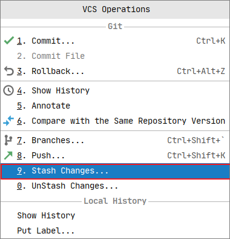
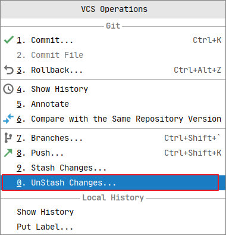

[[TOC]]

### 查看每一行代码的条件人, 提交时间（大部分人不知道）


**选择后入下图所示**


**鼠标移动上去还能看到提交详细信息**


### 克隆远程代码

> git clone origin url

常规操作


**装逼操作** 


### 拉取远程代码

> git pull 


**快捷方式**

```
ctrl + t
```


### 将暂存区代码提交到本地库

> git commit -m 'message'


### 将本地库 提交到远程库 

> git push


快捷键 

```
ctrl + shift + k
```

或

```
alt + 1 + 8
```


### 切换分支, 或拉取远程分支


以下提供几种快捷方式

```
ctrl + shift + `
```

或

```
alt + ~ + 7
```

或


###  查看当前打开类 历史记录

```
alt + ~ + 4
```


#### 查看项目工程历史记录

选中工程后

```
alt + ~ + 4
```

或 `alt + 9` 切换到 `Version Control` 面板 选择log


### Stash

应用场景

- 我在本地修改好后，发现远程分支已经被改动了，此时我本地也被改动了就造成了冲突，无法push或者pull。此时可以使用git stash

  ```shell
  1 git stash //把本地的改动暂存起来
  2 git pull  //拉取远端分支（此时本地分支会回滚到上次commit的情况，新的改动都存在了stash中）
  3 git stash pop // 将栈顶改动重新加回本地分支，就可以继续修改了，当然，如果改好了就是add,commit,push啥的。。
  ```

  

- 不小心改动了其他分支，例如忘记切换，直接在master分支上做改动，这里假设我的分支是test分支

  ```shell
  git stash          //把本地当前改动暂存起来，此时master分支就恢复到了上次拉取时的状态
  git checkout test  //切换到需要改动的分支
  git stash pop　　　 //将改动pop到自己当前的分支
  ```


Idea 将现在本地的修改存储在 Stash 中

`alt + ~`加 `9`



将 Stash 中的代码还原




### Check Out

将本地修改的代码还原对应命令 `git checkout <file>`

