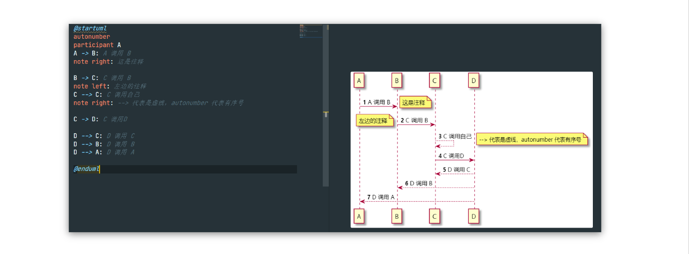
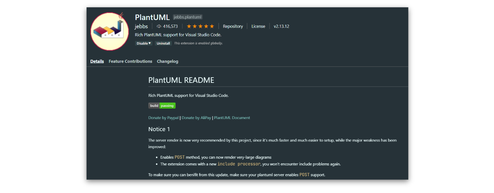
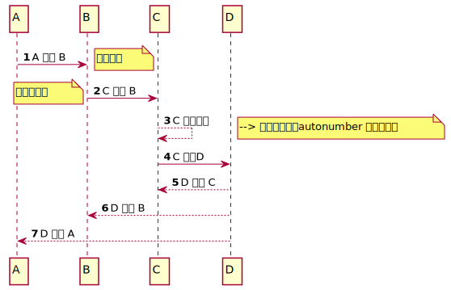

在 VsCode 中画时序图。



记得最开始自己不知道这个插件的时候，自己是使用 [processon](processon.com) 画时序图，说实话体验不是很好。在画的时候有的时候重心就偏离了，很多时候专注度都在画图这件事上，偏离了本身需要展现的逻辑。


### 安装



安装完成之后，创建 test.plantuml 文件，复制以下内容，时序图就绘制完成了。

```
@startuml
autonumber
participant A
A -> B: A 调用 B
note right: 这是注释

B -> C: C 调用 B
note left: 左边的注释
C --> C: C 调用自己
note right: --> 代表是虚线，autonumber 代表有序号

C -> D: C 调用D

D --> C: D 调用 C
D --> B: D 调用 B
D --> A: D 调用 A

@enduml

```


效果如下


 


### 常用操作

- 预览 时序图 *Alt + D*

- 导出时序图到其他的格式，比如 svg、png、pdf  

  `ctrl + shift + p -> >PlantUML: Export Current DIagram` 选择相应的 格式


参考上面的语法就能完成很多日常工作的图形绘制了，更多语法，[参考](https://plantuml.com/zh/component-diagram)