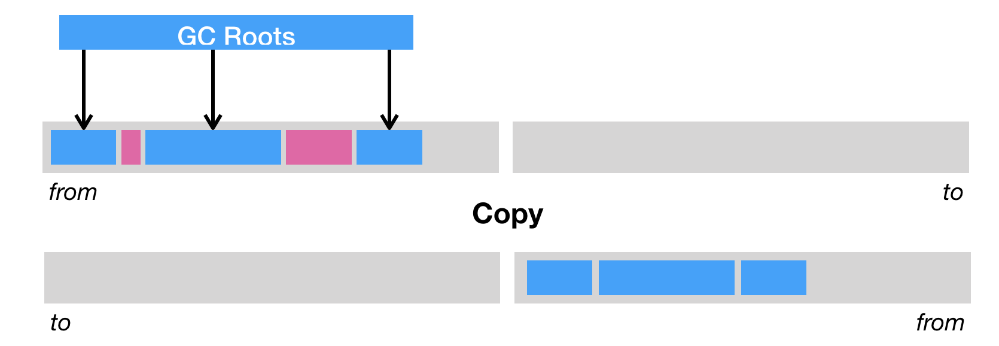

### 多线程 预备知识

- CPU 内存之间的速度完全不匹配衍生出【高速缓存】
- 任务的执行都是先将任务从【内存】中读取进【高速缓存】中后【CPU】进行计算
- Java count += 1 的执行过程
	- 指令 1：首先，需要把变量 count 从【内存】加载到 CPU 的【寄存器】；
	- 指令 2：之后，在寄存器中执行 +1 操作；
	- 指令 3：最后，将结果写入内存（缓存机制导致可能写入的是 CPU 缓存而不是内存）。
- CPU 层面的原子性指的是一条 CPU 指令是原子性的。但是大部分高级程序语言的一条指令在 CPU 层面都是用多条指令组成。

### Java 虚拟机堆划分

### 垃圾回收的三种方式

当标记完所有的存活对象时，我们便可以进行死亡对象的回收工作了。主流的基础回收方式可分为三种。

**第一种是清除（sweep）**，即把死亡对象所占据的内存标记为空闲内存，并记录在一个空闲列表（free list）之中。当需要新建对象时，内存管理模块便会从该空闲列表中寻找空闲内存，并划分给新建的对象。

清除这种回收方式的原理及其简单，但是有两个缺点。一是会造成内存碎片。由于 Java 虚拟机的堆中对象必须是连续分布的，因此可能出现总空闲内存足够，但是无法分配的极端情况。

另一个则是分配效率较低。如果是一块连续的内存空间，那么我们可以通过指针加法（pointer bumping）来做分配。而对于空闲列表，Java 虚拟机则需要逐个访问列表中的项，来查找能够放入新建对象的空闲内存。

**第二种是压缩（compact）**，即把存活的对象聚集到内存区域的起始位置，从而留下一段连续的内存空间。这种做法能够解决内存碎片化的问题，但代价是压缩算法的性能开销。

**第三种则是复制（copy）**，即把内存区域分为两等分，分别用两个指针 from 和 to 来维护，并且只是用 from 指针指向的内存区域来分配内存。当发生垃圾回收时，便把存活的对象复制到 to 指针指向的内存区域中，并且交换 from 指针和 to 指针的内容。复制这种回收方式同样能够解决内存碎片化的问题，但是它的缺点也极其明显，即堆空间的使用效率极其低下。

