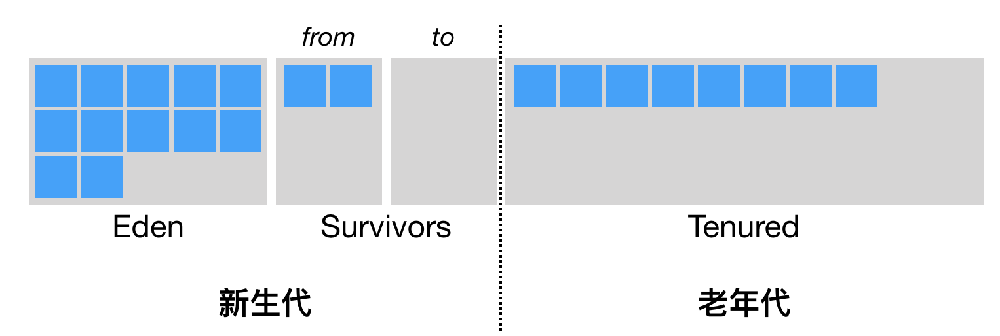
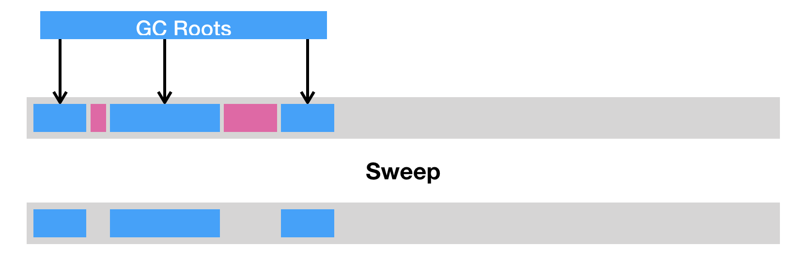

Java 与 C++ 之间有一堵由内存动态分配和垃圾收集技术所围成的“高墙”，墙外的人想进去，墙里面的人却想出来。

## 判断对象是否已经死亡

### 引用技术法

给对象添加一个引用计数器，每当有一个地方引用它时，计数器值就加 1；当引用失效时，计数器值减 1；任何时刻计数器为 0 的对象就是不能再使用的。

这个有循环引用的问题。

### 可达性分析算法

​ 

​ GC Roots 的对象包括下面几种：

- 虚拟机栈（栈帧中的本地变量表）中引用的对象。
- 方区中类静态属性引用的对象。
- 方法区中常量引用的对象。
- 本地方法栈中 JNI（Java Native Interface) 引用的对象

- 强引用（Strong Reference）

      	类似于 `Object obj = new Object();`这类引用，只要强引用还存在，垃圾收集器永远不会回收掉被引用的对象。

      	

- 软引用（Soft Reference）

      	一些还有用但非必需的对象。

* 弱引用（Weak Reference）

* 虚引用（Phantom Reference）

### Java 虚拟机堆划分

**第一种是标记-清除（sweep）**，即把死亡对象所占据的内存标记为空闲内存，并记录在一个空闲列表（free list）之中。当需要新建对象时，内存管理模块便会从该空闲列表中寻找空闲内存，并划分给新建的对象。

清除这种回收方式的原理及其简单，但是有两个缺点。一是会造成内存碎片。由于 Java 虚拟机的堆中对象必须是连续分布的，因此可能出现总空闲内存足够，但是无法分配的极端情况。

另一个则是分配效率较低。如果是一块连续的内存空间，那么我们可以通过指针加法（pointer bumping）来做分配。而对于空闲列表，Java 虚拟机则需要逐个访问列表中的项，来查找能够放入新建对象的空闲内存。

**第二种是压缩（compact）**，即把存活的对象聚集到内存区域的起始位置，从而留下一段连续的内存空间。这种做法能够解决内存碎片化的问题，但代价是压缩算法的性能开销。

**第三种则是复制（copy）**，即把内存区域分为两等分，分别用两个指针 from 和 to 来维护，并且只是用 from 指针指向的内存区域来分配内存。当发生垃圾回收时，便把存活的对象复制到 to 指针指向的内存区域中，并且交换 from 指针和 to 指针的内容。复制这种回收方式同样能够解决内存碎片化的问题，但是它的缺点也极其明显，即堆空间的使用效率极其低下。

### 垃圾回收的详细过程

####

所有新生成的对象首先都是放在年轻代。年轻代的目标就是尽可能快速的收集掉那些生命周期短的对象。年轻代一般分 3 个区，1 个 Eden 区，2 个 Survivor 区（from 和 to）。

大部分对象在 Eden 区中生成。当 Eden 区满时，还存活的对象将被复制到 Survivor 区（两个中的一个），当一个 Survivor 区满时，此区的存活对象将被复制到另外一个 Survivor 区，当另一个 Survivor 区也满了的时候，从前一个 Survivor 区复制过来的并且此时还存活的对象，将可能被复制到年老代。

2 个 Survivor 区是对称的，没有先后关系，所以同一个 Survivor 区中可能同时存在从 Eden 区复制过来对象，和从另一个 Survivor 区复制过来的对象；而复制到年老区的只有从另一个 Survivor 区过来的对象。而且，因为需要交换的原因，Survivor 区至少有一个是空的。特殊的情况下，根据程序需要，Survivor 区是可以配置为多个的（多于 2 个），这样可以增加对象在年轻代中的存在时间，减少被放到年老代的可能。

针对年轻代的垃圾回收即 MinorGC。

### 对象什么时候进入老年代

- **Minor GC 时，Eden 区对象 内存大于 Survivors 区**

      	当在进行 Minor GC 时，如果 Eden 区的对象所占用的内存不足以放入 Survivors 区，那么这时会通过【**对象担保机制**】提前转移到老年代区

- **大对象也会直接进入老年代**

- **长期存活的对象进入老年代**

      	在年轻代中经历了15次（可配置）垃圾回收后仍然存活的对象，就会被复制到年老代中。因此，可以认为年老代中存放的都是一些生命周期较长的对象。

- **动态对象年龄判断**

      	如果 Survivor 空间中的相同的年龄所有对象的总和大于 Survivor 空间的一半，年龄大于等于该年龄的对象就可以直接进入老年代
