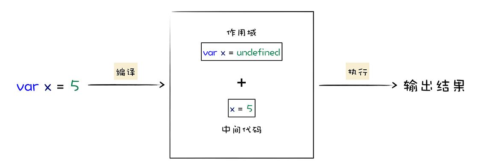

## JavaScript 设计思想


## V8 执行 JavaScript 代码的完整流程


## V8 执行 JavaScript 代码


其主要核心流程分为编译和执行两步。首先需要将 JavaScript 代码转换为低级中间代码或者机器能够理解的机器代码，然后再执行转换后的代码并输出执行结果。





## 高级代码为什么需要先编译再执行


CPU 不能直接识别汇编语言。


虽然汇编语言对机器语言做了一层抽象，减少了程序员理解机器语言的复杂度，但是汇编语言依然是复杂且繁琐的，即便你写一个非常简单的功能，也需要实现大量的汇编代码，这主要表现在以下两点。

首先，不同的 CPU 有着不同的指令集，如果要使用机器语言或者汇编语言来实现一个功能，那么你需要为每种架构的 CPU 编写特定的汇编代码，这会带来巨大的、枯燥繁琐的操作，你可以参看下图：


## 解释执行流程


## 编译执行流程


## 函数申明和函数表达式


上方两处代码，执行的时候 使用函数表达式的 方式，执行会报错。提示 `foo is not a function`

原因是


## JavaScript 中的 new

```javascript
function DogFactory(type,color){
    this.type = type
    this.color = color
}

var dog = new DogFactory('Dog','Black')
```


上方 new 的对象，对应的 V8 的执行代码

```javascript
var dog = {}  
dog.__proto__ = DogFactory.prototype
DogFactory.call(dog,'Dog','Black')
```


- 首先，创建了一个空白对象 dog；
- 然后，将 DogFactory 的 prototype 属性设置为 dog 的原型对象，这就是给 dog 对象设置原型对象的关键一步，我们后面来介绍；
- 最后，再使用 dog 来调用 DogFactory，这时候 DogFactory 函数中的 this 就指向了对象 dog，然后在 DogFactory 函数中，利用 this 对对象 dog 执行属性填充操作，最终就创建了对象 dog。