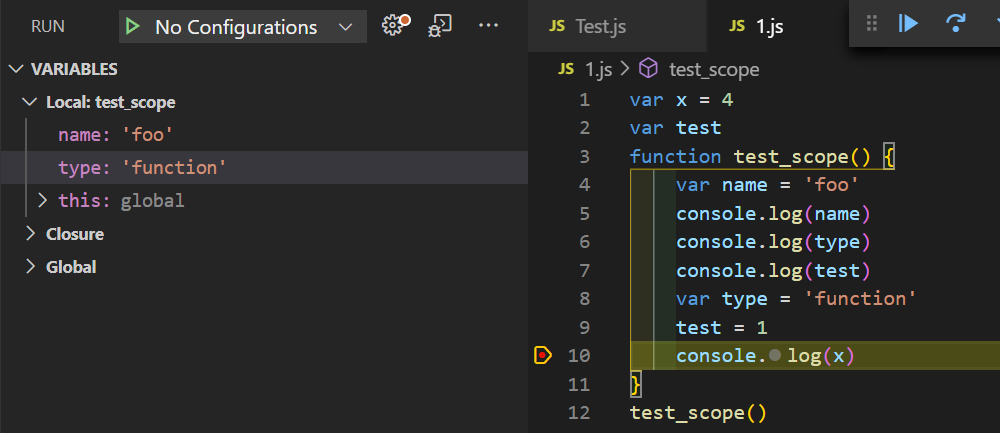

对于我个人来说，这个词语听到过很多次。说实话 也学了很多次，但真的没怎么特别清楚的搞明白过。

2020 年工作的中心更多的还是在 NodeJs 这边，还是需要加深对 Js 的掌握的。不能跟多的停留在用的层面。


:::tip 菜鸟教程 JavaScript 作用域

在 JavaScript 中，可以访问的变量，对象，函数的集合可称之为作用域。

:::


:::tip 红宝书 4.2 执行环境及作用域

当代码在一个环境中执行时，会创建变量对象的一个作用域链。作用域链的多用途，是保证对执行环境有权访问的所有变量和函数的有序访问。

:::


#### 什么是函数作用域和全局作用域。

看下面的一段代码

```javascript
var x = 4
var test
function test_scope() {
    var name = 'foo'
    console.log(name)
    console.log(type)
    console.log(test)
    var type = 'function'
    test = 1
    console.log(x)
}
test_scope()  
```

在上面的代码中，我们定义了一个 test_scope 函数，那么在 V8 执行 test_scope 函数的时候，在编译阶段会为 test_scope 函数创建一个作用域，在 test_scope 函数中定义的变量和声明的函数都会丢到该作用域中，因为我们在 test_scope 函数中定了三个变量，那么常见的作用域就包含有这三个变量。


我们可以用 VsCode 的调试模式进行查看



上图中，Local 部分就是 test_scope 函数的作用域。可以看到我们在 test_scope 函数中使用了变量 x 。

在本作用域中并没有变量x，这个时候。如果在当前函数作用域中没有查找到变量，那么 V8 会去全局作用域中去查找，这个查找的线路就称为**作用域链**。


观看下方代码。

```javascript

var name = 'atips'
var type = 'global'


function foo(){
    var name = 'foo'
    console.log(name)
    console.log(type)
}


function bar(){
    var name = 'bar'
    var type = 'function'
    foo()
}
bar()
```

最后的输出是什么呢？

```javascript
foo
global
```


为什么 type 的值不是定义在 bar 函数中的 function 而是 定义在最外层的 global 呢。其实我自己觉得是应该是 function 的


:::tip 极客时间 图解 Google V8

因为 JavaScript 是基于词法作用域的，词法作用域就是指，查找作用域的顺序是按照函数定义时的位置来决定的。bar 和 foo 函数的外部代码都是全局代码，所以无论你是在 bar 函数中查找变量，还是在 foo 函数中查找变量，其查找顺序都是按照当前函数作用域–> 全局作用域这个路径来的。

:::


这样就明白了， JavaScript 是基于此法作用域，跟函数调用的地方无关，只跟函数定义的地方有关。

