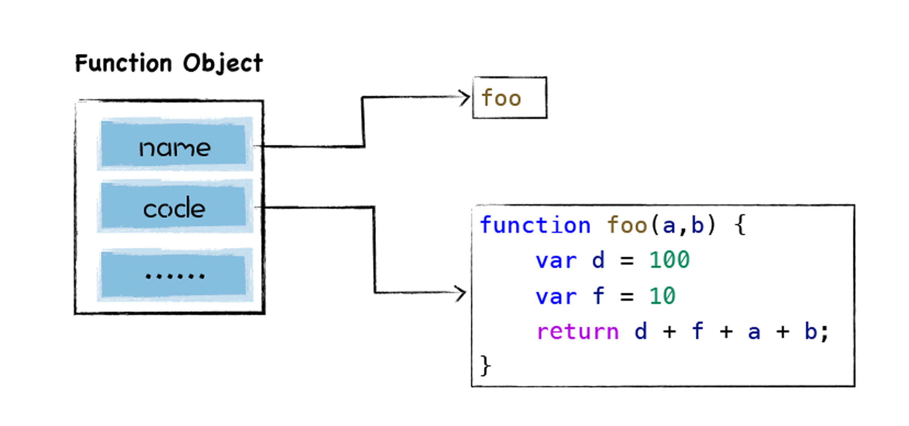

我不知道什么叫闭包，如果面试有人让我手写闭包的话。我想想

```javascript
function foo() {
  var a = 1;

  function bar() {
    console.info(a);
  }

  return bar;
}

const closure = foo();

closure();
```

我想我应该能写出这样的代码，一个函数中嵌套着另外一个函数。


请问什么是闭包？

艹，我也描述不清楚概念。


:::tip 慕课网 闭包与高阶函数

当函数可以**记住并访问**所在的词法作用域时，就产生了**闭包**，即使函数是在当前词法作用域之外执行。 

:::


:::tip 阮一峰 学习 JavaScript 闭包

闭包就是能够读取其他函数内部变量的函数。

由于在 JavaScript 语言中，只有函数内部的子函数才能读取局部变量，因此可以把闭包简单理解成"定义在一个函数内部的函数"。

所以，在本质上，闭包就是将函数内部和函数外部连接起来的一座桥梁。 

:::


:::tip MDN 闭包

函数和对其周围状态（**lexical environment，词法环境**）的引用捆绑在一起构成**闭包**（**closure**）。也就是说，闭包可以让你从内部函数访问外部函数作用域。在 JavaScript 中，每当函数被创建，就会在函数生成时生成闭包。

:::


## 闭包是如何实现的？

在 Google V8 专栏中讲到，为了再编译和执行阶段获取得到更好的性能，目前所有的 JavaScript 虚拟机都实现了 **惰性解析**。

> 所谓惰性解析是指解析器在解析的过程中，如果遇到函数声明，那么会跳过函数内部的代码，并不会为其生成 AST 和字节码，而仅仅生成顶层代码的 AST 和字节码。


**惰性解析的大致流程**

```javascript

function foo(a,b) {
    var d = 100
    var f = 10
    return d + f + a + b;
}
var a = 1
var c = 4
foo(1, 5)
```

当把这段代码交给 V8 处理时，V8 会至上而下解析这段代码，在解析过程中首先会遇到 foo 函数，由于这只是一个函数声明语句，V8 在这个阶段只需要将该函数转换为函数对象，如下图所示：



注意，这里只是将该函数声明转换为函数对象，但是并没有解析和编译函数内部的代码，所以也不会为 foo 函数的内部代码生成抽象语法树。


然后继续往下解析，由于后续的代码都是顶层代码，所以 V8 会为它们生成抽象语法树，最终生成的结果如下所示：


代码解析完成之后，V8 便会按照顺序自上而下执行代码，首先会先执行“a=1”和“c=4”这两个赋值表达式，接下来执行 foo 函数的调用，过程是从 foo 函数对象中取出函数代码，然后和编译顶层代码一样，V8 会先编译 foo 函数的代码，编译时同样需要先将其编译为抽象语法树和字节码，然后再解释执行。


上面就是惰性解析的大概流程

:::tip 惰性解析 总结

简单来说就是 V8 在编译 JavaScript 代码的时候，会跳过 方法内部的编译，真正到执行的时候才会编译。

:::


JavaScript 中闭包相关的重要特性

- 可以在 JavaScript 函数内部定义新的函数
- 内部函数可以访问父函数中定义的变量
- 因为 JavaScript 中函数是一等公民，所以函数可以作为另一个函数的返回值


```js

function foo() {
    var d = 20
    return function inner(a, b) {
        const c = a + b + d
        return c
    }
}
const f = foo()
```

上述代码的执行过程

- 当调用 foo 函数时，foo 函数会将它的内部函数 inner 返回给全局变量 f；
- 然后 foo 函数执行结束，执行上下文被 V8 销毁；
- 虽然 foo 函数的执行上下文被销毁了，但是依然存活的 inner 函数引用了 foo 函数作用域中的变量 d。


按照通用的做法，d 已经被 v8 销毁了，但是由于存活的函数 inner 依然引用了 foo 函数中的变量 d，这样就会带来两个问题：

- 当 foo 执行结束时，变量 d 该不该被销毁？如果不应该被销毁，那么应该采用什么策略？

- 如果采用了惰性解析，那么当执行到 foo 函数时，V8 只会解析 foo 函数，并不会解析内部的 inner 函数，那么这时候 V8 就不知道 inner 函数中是否引用了 foo 函数的变量 d。


:::tip 极客时间 Google V8

在执行 foo 函数的阶段，虽然采取了惰性解析，不会解析和执行 foo 函数中的 inner 函数，但是 V8 还是需要判断 inner 函数是否引用了 foo 函数中的变量，负责处理这个任务的模块叫做预解析器。

:::


## 预解析器解决的问题

- 判断函数中是否有语法错误，如果发现语法错误，那么将会给 V8 抛错
- 除了检查语法错误之外，预解析器另外的一个重要的功能就是检查函数内部是否引用了外部变量，如果引用了外部的变量，预解析器会将栈中的变量复制到堆中，在下次执行到该函数的时候，直接使用堆中的引用，这样就解决了闭包所带来的问题。