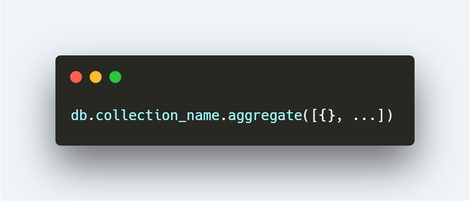

[[TOC]]

### _Id 不能直接和 String  进行比较

```javascript
user._id === article.userId
```

在 mongoose 中不能使用上面的比较，因为 monoose 中的 _id 是ObjectID 类型，是 BSON 中的一种类型，所以不能直接比较，如果需要比较，则可以用 ObjectId 中的 equals 方法

```javascript
user._id.equals(article.userId)
```


### toObject toJson

在mongoose 中查询出来的对象默认是不可更改的，如果需要更改，则需要在对象后添加 toObject 才能更改

```javascript
let model = new Model();
model.name = "model name";
console.info(model.name); // null

model = model.toObject();
model.name = 'model name';
console.info(model.name); // model.name
```


### lean

上方的两个问题 _id 比较， 和 toObject 出现的根本原因是通过mongooses 查询出来的对象还不能算是一个JavaScript 还是一个 Mongoose 的对象，查询出来的对象是可以进行 update, create, delete 等一系列的操作的。

这个时候我们可以用 查询的 lean 方法，手动的将查询出来的 mongoose 对象转换为 JavaScript 对象 这个时候就不会有上面的问题了

```javascript
this.ctx.model.user.find().lean();
```


### 字段递增、递减

递增

```javascript
await model.findOneAndUpdate({ _id }, { $inc: {views: 1} });
```

递减，需要判断当前已经大于 0

```javascript
await model.findOneAndUpdate({ _id, {views: {$gt: 0}}, { $inc: {views: -1} }});
```


### 常用查询

| 方法名   | 含义                                                         |                                    |
| -------- | ------------------------------------------------------------ | ---------------------------------- |
| find     | 通用查询，方法的查询结果是数组，即使没查询到内容，也会返回 [] 空数组。 |                                    |
| findById | `Model.findById(id,[projection],[options],[callback])`       |                                    |
| findOne  | `Model.findOne(conditions, [projection], [options], [callback])` | 该方法返回查找到的所有实例的第一个 |


**操作符**

| $eq  | 与指定的值相等                           |
| ---- | ---------------------------------------- |
| $ne  | 与指定的值不相等                         |
| $gt  | 大于指定的值                             |
| $gte | 大于等于指定的值                         |
| $lt  | 小于指定的值                             |
| $lte | 小于等于指定的值                         |
| $in  | 与查询数组中指定的值中的任何一个匹配     |
| $nin | 与查询数组中指定的值中的任何一个都不匹配 |


**字段相关操作符**

| 符号    | 描述                       |
| ------- | -------------------------- |
| $exists | 匹配存在制定字段的文档     |
| $type   | 返回字段属于指定类型的文档 |


**数组字段查找**

| 符号       | 描述                                                   |
| ---------- | ------------------------------------------------------ |
| $all       | 匹配包含查询数组中指定的所有条件的数组字段             |
| $elemMatch | 匹配数组字段中的某个值满足 $elemMatch 中指定的所有条件 |
| $size      | 匹配数组字段的 length 与指定的大小一样的 document      |


**projection 投影**

其实就是看哪个字段显示，哪个字段不显示

```javascript
UserModel.find({}, {name: 1, age: 1, sex: 0});
```

上面的查询就代表了，只显示 name、age、sex 字段


**Options**

| 操作  | 作用                                                         |
| ----- | ------------------------------------------------------------ |
| sort  | 按照排序规则根据所给的字段进行排序，值可以是 asc，desc，ascending，descending，1，和 -1。 |
| limit | 指定返回结果的最大数量                                       |
| skip  | 指定要跳过的文档数量                                         |
| lean  | 返回普通的 js 对象，而不是 `Mongoose Documents`。建议不需要 mongoose 特殊处理就返给前端的数据都最好使用该方法转成普通 js 对象。 |

::: tip

在 limit、skip 一起使用时，调用顺序并不重要，返回的数据都是先排序后限制数量

```javascript
// 效果一样
Model.find().limit(2).sort('age');
Model.find().sort('age').limit(2);
```

:::


### 修改

- findOneAndUpdate
- findByIdAndUpdate
- update
- updateMany


```javascript
Model.findOneAndUpdate(filter, update, [options], [callback]);

// update
// {operator: { field: value, ... }}
```

:::warning

必须使用 update 操作符。如果没有操作符或操作符不是 `update` 操作符，统一被视为 `$set` 操作（mongoose 特有）

:::


**字段相关操作符**

| 符号         | 描述                                                     |
| ------------ | -------------------------------------------------------- |
| $set         | 设置字段值                                               |
| $currentDate | 设置字段值为当前时间，可以是 `Date` 或时间戳格式。       |
| $min         | 只有当指定值小于当前字段值时更新                         |
| $max         | 只有当指定值大于当前字段值时更新                         |
| $inc         | 将字段值增加`指定数量`，`指定数量`可以是负数，代表减少。 |
| $mul         | 将字段值乘以指定数量                                     |
| $unset       | 删除指定字段，数组中的值删后改为 null。                  |


**数组字段相关操作符**

| 符号      | 描述                                                         |
| --------- | ------------------------------------------------------------ |
| $         | 充当占位符，用来表示匹配查询条件的数组字段中的第一个元素 `{operator:{ "arrayField.$" : value }}` |
| $addToSet | 向数组字段中添加之前不存在的元素 `{ $addToSet: {arrayField: value, ... }}`，value 是数组时可与 `$each` 组合使用。 |
| $pop      | 向数组字段的末尾添加元素 `{ $push: { arrayField: value, ... } }`，value 是数组时可与 `$each` 等修饰符组合使用 |
| $pull     | 移除数组字段中的第一个或最后一个元素 `{ $pop: {arrayField: -1(first) / 1(last), ... } }` |
| $pullAll  | 移除数组字段中与查询条件匹配的所有元素 `{ $pull: {arrayField: value / condition, ... } }` |
| $push     | 从数组中删除所有匹配的值 `{ $pullAll: { arrayField: [value1, value2 ... ], ... } }` |


**修饰符**

- $each
- $position
- $slice
- $sort


### 删除

- findOneAndDelete
- findByIdAndDelete
- deleteMany
- deleteOne
- findOneAndRemove
- findByIdAndRemove
- remove


### aggregate



- $project

  修改文档的结构，可以用来重命名、增加或删除文档中字段

  ```javascript
  //只返回a和b字段
  Model.aggregate([
      {
          $project: { a: 1, b: 1 }
      }
  ]);
  ```

  

- $match

  用于过滤文档，用法类似于find()方法中的参数

  ```javascript
  
  //返回符合price大于或等于100的数据
  Model.aggregate([
      {
          $match: { 'price': { $gte: 100 } }
      }
  ]);
  
  ```

  

- $limit

  只返回一条数据

  ```javascript
  Model.aggregate([
      {
          $limit: 1 
      }
  ]);
  ```

  

- $skip

  跳过第一条，返回之后的数据

  ```javascript
  Model.aggregate([
      {
          $skip: 1 
      }
  ]);
  ```

  

- $sort

  以price倒序排列

  ```javascript
  Model.aggregate([
      {
          $sort: { 'price': -1 }
      }
  ]);
  ```

  

- $group

  以order_id进行分组，并统计每组的数量

  ```javascript
  Model.aggregate([
      {
          $group: {_id: "$order_id", total: {$sum: "$num"}}
      }
  ]);
  ```

  

- $lookup

  ```javascript
  Model.aggregate([
      {
          $lookup: {
              from: 'student', // 和student表进行关联
              localField: 'class_id', // 此表字段名为 class_id
              foreignField: 'class_id', // 关联表中字段为 class_id
              as: 'students' // 用students 字段接收符合要求的内容
          }
      },
  ]);
  
  ```


### MongoDB 导入导出

导出

```shell
mongodump --archive=egg_xgimi_app.gz --gzip --db=egg_xgimi_app
```


导入

```shell
mongorestore -h 127.0.0.1 -d 导入的数据库库名称

mongorestore --gzip --archive=<filename>.agz --db test -u <username> -p <password> --authenticationDatabase 'admin' --port 27000 --host <hostname>
```


### Model Virtual

:::tip

mongoose 的 virtual 需要配合  populate 使用，有奇效

:::

```js
  
Task.virtual('comment', {
    ref: 'Comment',
    localField: '_id',
    foreignField: 'task',
    justOne: false,
    count: true,
});
```

