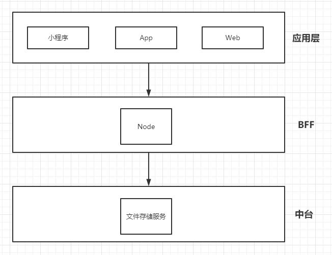
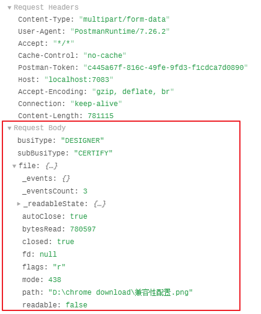

## 背景

对接中台业务，中台提供 **文件上传** 基础服务。

Node 作为 BFF 对接中台，对接接口转发、聚合处理后提供给前端使用。



### 问题

文件上传接口和其他的接口不一样，直接转发不能使用。

前端是通过 Blob 对象进行文件上传的。

Blob 对象表示一个不可变、原始数据的类文件对象。Blob 表示的不一定是JavaScript原生格式的数据。File 接口基于Blob，继承了 blob 的功能并将其扩展使其支持用户系统上的文件。

用 Postman 查看 请求头 和 请求体



可以看到 上传的对应的 file 选项, 如果我们直接将 上面的 file 对象直接转到 中台的接口上，对应的中台 是不能解析的。


### 解决方案

```js
let data = new FormData();
data.append('busiType', payload["busiType"]);
data.append('subBusiType', payload['subBusiType']);
data.append('file', fs.createReadStream(this.ctx.request.files[0].filepath));
const uploadURL = this.ctx.app.config.gmui.ucenterService + "/open/user/common/uploadImg";
let config = {
    method: 'post',
    url: uploadURL,
    headers: {
        'Content-Type': 'multipart/form-data',
        ...data.getHeaders()
    },
    data : data
};

const result = await axios(config);
```


**浏览器文件上传**

因为浏览器本身的限制，浏览器是不能直接操作文件系统的，需要通过浏览器所暴露出来的统一接口，由用户主动授权发起来访问文件动作，然后读取文件内容进指定内存里，最后执行提交请求操作，将内存里的文件内容数据上传到服务端，最后服务端解析前端传来的数据信息后存入文件里。