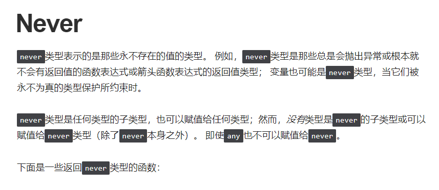
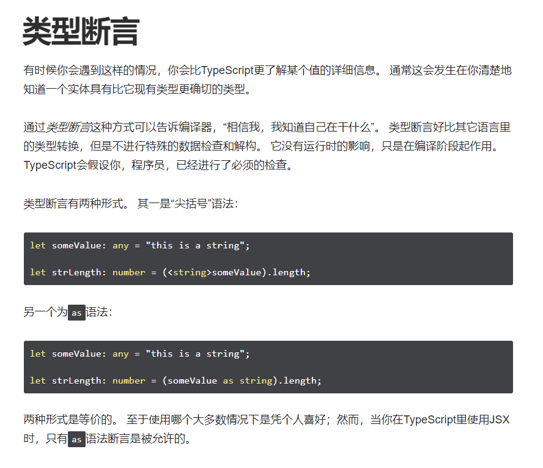
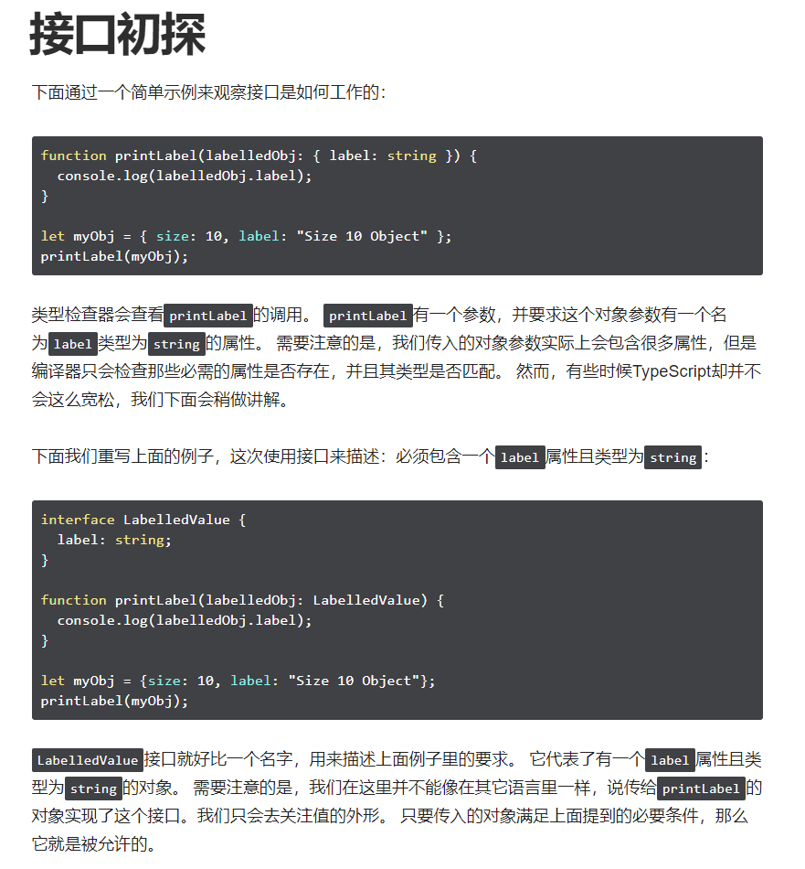

- 基础类型

    特别注意点，枚举、空值、元组、Never，其他都差不多


  

  ```typescript
  // 返回never的函数必须存在无法达到的终点
  function error(message: string): never {
      throw new Error(message);
  }
  
  // 推断的返回值类型为never
  function fail() {
      return error("Something failed");
  }
  
  // 返回never的函数必须存在无法达到的终点
  function infiniteLoop(): never {
      while (true) {
      }
  }
  ```

  



- 变量声明

- 接口

- 类

- 函数

- 泛型

- 枚举

- 类型推论

- 类型兼容性

- 高级类型

- Symbols

- Iterators 和 Generators

- 模块

- 命名空间

- 命名空间和模块

- 模块解析

- 声明合并

- 书写.d.ts文件

- JSX

- Decorators

- 混入

- 三斜线指令

- JavaScript文件里的类型检查